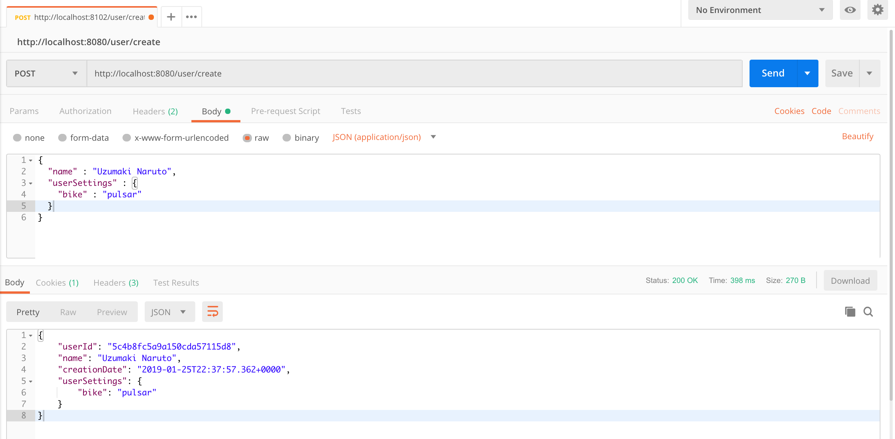
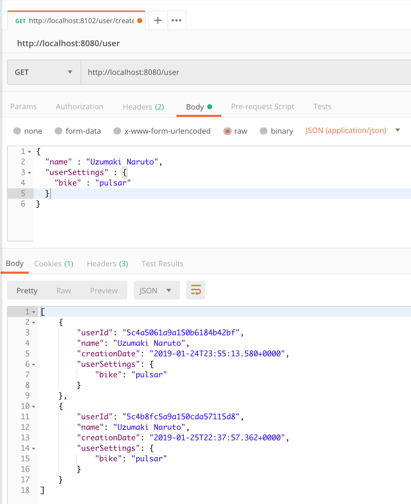
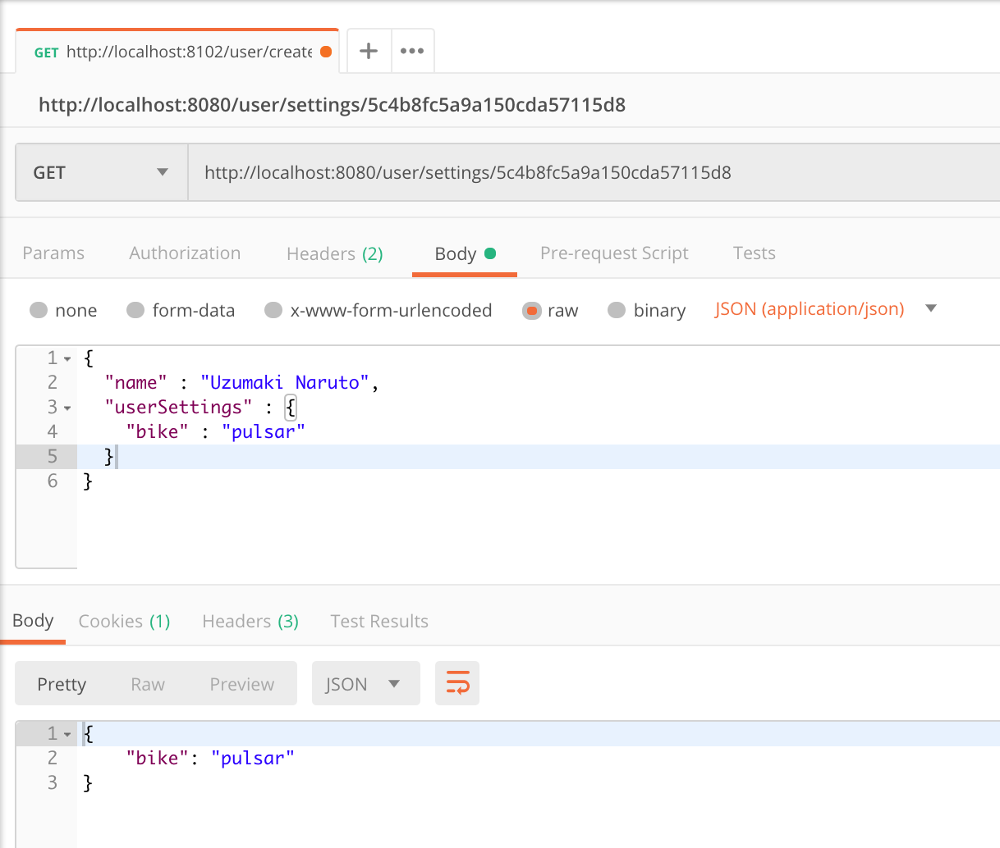

# spring-boot-mongodb-sample

#### Thing to do :
1. Clone this repo : `git clone https://github.com/hendisantika/spring-boot-mongodb-sample.git`
2. Go to it's folder : `cd spring-boot-mongodb-sample`
3. Run this app : `mvn clean spring-boot:run`

#### Spring Boot MongoDB APIs

We will have following functionalities and Database interactions in our app.

* Get all users
* Get a user with ID
* Get user settings
* Get a particular key from the Map
* Add/Update user setting

#### Add new user
```
GET /user/create
```

Request :

http://localhost:8080/user/create
```
{
  "name" : "Naruto",
  "userSettings" : {
    "bike" : "pulsar"
  }
}
```

Response :
```
{
    "userId": "5c4b8fc5a9a150cda57115d8",
    "name": "Uzumaki Naruto",
    "creationDate": "2019-01-25T22:37:57.362+0000",
    "userSettings": {
        "bike": "pulsar"
    }
}
```



Get All Users : http://localhost:8080/user/



Get User setting : http://localhost:8080/user/settings/{userId}




